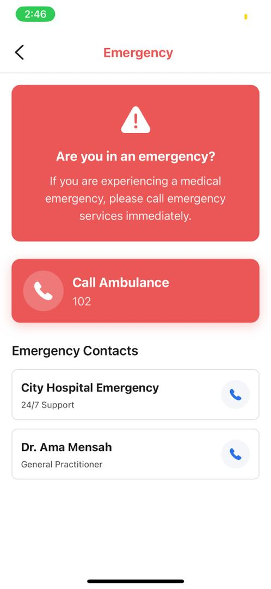
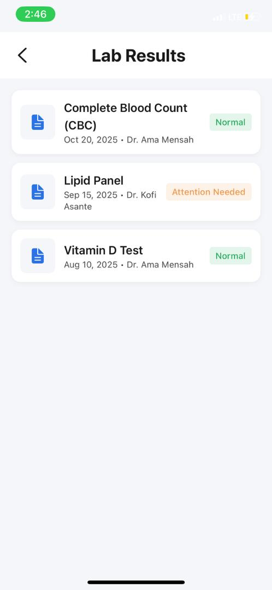
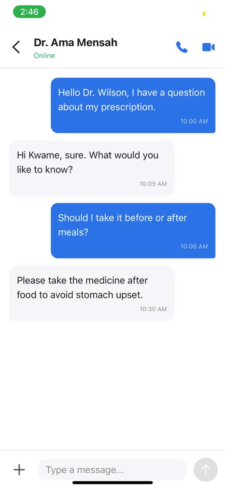
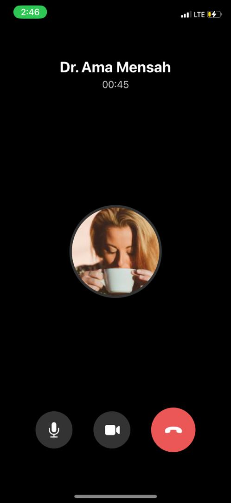
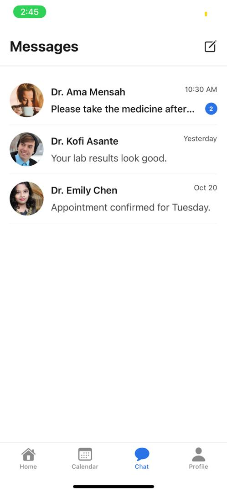
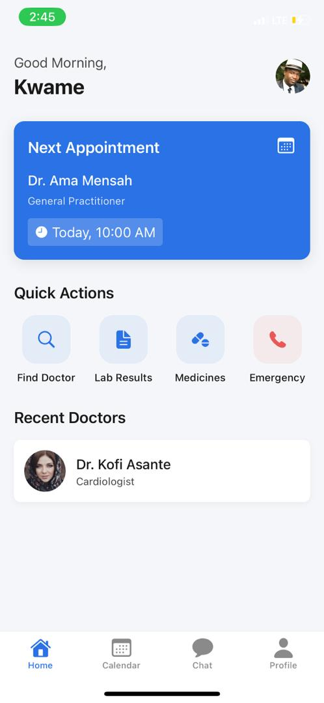

# HealthApp - Healthcare Appointment Mobile Application

> A production-ready React Native healthcare platform built with Expo, TypeScript, and modern mobile development best practices.

## 🎯 Project Overview

HealthApp is a comprehensive mobile healthcare solution that enables patients to seamlessly manage their medical appointments, communicate with healthcare providers, access lab results, and track medications. The application demonstrates enterprise-level architecture, clean code principles, and a user-centric design approach suitable for real-world deployment.

**Built for**: Healthcare providers, clinics, and hospitals seeking a modern patient engagement platform  
**Target Users**: Patients seeking convenient access to healthcare services  
**Platform**: iOS & Android (Cross-platform)

---

## ✨ Key Features

### 🔐 **User Authentication & Onboarding**
- Secure email/password authentication with form validation
- Persistent session management using React Context API
- First-time user onboarding flow with feature highlights
- Custom animated splash screen for brand experience

### 🏥 **Appointment Management**
- **Doctor Discovery**: Search and filter healthcare providers by specialty
- **Detailed Provider Profiles**: View credentials, ratings, reviews, and availability
- **Smart Booking**: Interactive calendar with real-time slot availability
- **Appointment Tracking**: List and calendar views of upcoming and past appointments
- **Flexible Actions**: Reschedule or cancel appointments with confirmation flows

### 💬 **Telemedicine & Communication**
- **In-App Messaging**: Real-time chat interface with healthcare providers
- **Video Consultations**: Integrated video call UI for remote appointments
- **Message History**: Persistent conversation threads with doctors

### 🧪 **Medical Records & Lab Results**
- **Test Results Dashboard**: Organized view of all lab reports
- **Detailed Analysis**: Breakdown of test metrics with normal range indicators
- **Status Indicators**: Visual cues for normal, attention-needed, and abnormal results
- **Report Access**: View and download full PDF reports

### 💊 **Medication Management**
- **Prescription Tracking**: List of current medications with dosage information
- **Refill Reminders**: Track remaining supply and request refills
- **Medication Details**: Dosage, frequency, and administration instructions

### 🚨 **Emergency Services**
- **Quick Access**: One-tap emergency contact screen
- **Emergency Contacts**: Pre-configured healthcare provider contacts
- **Ambulance Services**: Direct call integration for emergency response

### ⚙️ **Profile & Settings**
- **Personal Information**: Manage user profile and contact details
- **Payment Methods**: Secure payment card management
- **Notification Preferences**: Customizable alert settings
- **Privacy & Security**: Password management, biometric authentication
- **Legal Documents**: Terms of Service and Privacy Policy access

---

## 📸 Screenshots

### Authentication & Onboarding

*Secure login interface with email/password authentication and social login options*


*Interactive onboarding screens introducing key app features to new users*

### Home & Dashboard

*Personalized home screen with upcoming appointments, quick actions, and recent doctors*

### Doctor Discovery & Booking

*Search and filter doctors by specialty with ratings and reviews*


*Detailed doctor profiles with credentials, experience, and patient reviews*

### Appointments & Communication

*Calendar view of appointments with monthly overview and appointment details*


*Real-time messaging with healthcare providers for consultations and follow-ups*

### Profile & Settings

*User profile management with settings, medical records, and account options*

---

## �🛠️ Technical Architecture

### **Core Technologies**
- **Framework**: React Native 0.76+ with Expo SDK 52
- **Language**: TypeScript 5.3+ for type safety and developer experience
- **Navigation**: Expo Router (file-based routing) for intuitive navigation structure
- **State Management**: React Context API for global state (Auth, User)
- **Storage**: AsyncStorage for persistent local data
- **UI Components**: Custom component library with consistent design system

### **Design System**
- **Theme**: Centralized theme constants (Colors, Spacing, Typography, Shadows)
- **Components**: Reusable UI primitives (Button, Input, Typography, IconSymbol)
- **Style Approach**: Clinical modern design inspired by Apple Health and Mayo Clinic
- **Color Palette**: 
  - Primary: `#2A72E5` (Medical Blue)
  - Background: `#FFFFFF` (Clean White)
  - Text: `#1A1A1A` (Charcoal)
  - Accent: Soft blues and grays for professional aesthetic

### **Project Structure**
```
healthapp/
├── app/                          # Expo Router screens
│   ├── (tabs)/                   # Bottom tab navigation
│   │   ├── index.tsx            # Home dashboard
│   │   ├── appointments.tsx     # Appointments list & calendar
│   │   ├── chat.tsx             # Chat conversations list
│   │   └── profile.tsx          # User profile
│   ├── auth/                     # Authentication flow
│   │   ├── login.tsx
│   │   └── signup.tsx
│   ├── doctors/                  # Doctor search & booking
│   │   ├── index.tsx            # Search & filter
│   │   ├── [id].tsx             # Doctor profile
│   │   └── book.tsx             # Booking flow
│   ├── appointment/              # Appointment details
│   ├── lab-results/              # Medical records
│   ├── medicines/                # Medication management
│   ├── emergency/                # Emergency services
│   ├── chat/                     # Chat room
│   ├── call/                     # Video call UI
│   ├── profile/                  # Profile sub-screens
│   ├── settings/                 # App settings
│   ├── onboarding/               # First-time user flow
│   └── _layout.tsx              # Root layout & navigation
├── components/
│   └── ui/                       # Reusable UI components
│       ├── Button.tsx
│       ├── Input.tsx
│       ├── Typography.tsx
│       └── icon-symbol.tsx
├── constants/
│   └── theme.ts                  # Design tokens
├── context/
│   └── AuthContext.tsx           # Authentication state
├── services/
│   └── api.ts                    # API service layer
└── types/                        # TypeScript definitions
```

### **Code Quality & Best Practices**
- **TypeScript**: Strict type checking for reduced runtime errors
- **Component Architecture**: Functional components with React Hooks
- **Code Organization**: Feature-based folder structure for scalability
- **Naming Conventions**: Clear, descriptive naming for maintainability
- **Error Handling**: Graceful error states and user feedback
- **Performance**: Optimized rendering with React.memo and useMemo where appropriate

---

## 🚀 Getting Started

### **Prerequisites**
- Node.js 18+ and npm/yarn
- Expo CLI (`npm install -g expo-cli`)
- iOS Simulator (macOS) or Android Emulator

### **Installation**

1. **Clone the repository**
   ```bash
   git clone https://github.com/berggycam/doctor-appointment-app.git
   cd doctor-appointment-app
   ```

2. **Install dependencies**
   ```bash
   npm install
   ```

3. **Start the development server**
   ```bash
   npx expo start
   ```

4. **Run on device/emulator**
   - Press `a` for Android emulator
   - Press `i` for iOS simulator
   - Scan QR code with Expo Go app on physical device

---

## 📱 App Screens & User Flow

### **Authentication Flow**
1. **Splash Screen** → Animated brand introduction
2. **Onboarding** → Feature highlights for first-time users
3. **Login/Signup** → Secure authentication with validation

### **Main Application Flow**
1. **Home Dashboard** → Personalized greeting, next appointment, quick actions
2. **Find Doctor** → Search by specialty → View profile → Book appointment
3. **Appointments** → View upcoming/past → Calendar view → Appointment details
4. **Chat** → Conversation list → Chat room → Video call
5. **Profile** → Personal info → Settings → Medical records → Logout

---

## 🎨 Design Philosophy

The application follows a **clinical modern** design approach:

- **Trustworthy**: Clean white backgrounds and professional typography convey medical credibility
- **Accessible**: High contrast ratios and clear visual hierarchy ensure readability
- **Intuitive**: Familiar patterns and clear navigation reduce cognitive load
- **Consistent**: Unified design system across all screens for cohesive experience
- **Responsive**: Adaptive layouts that work seamlessly on various screen sizes

**Design Inspirations**: Apple Health, Mayo Clinic App, NHS App

---

## 🔄 Future Enhancements

### **Phase 1: Backend Integration**
- [ ] Connect to REST API or GraphQL backend
- [ ] Implement real authentication with JWT tokens
- [ ] Integrate payment gateway (Stripe/PayPal)
- [ ] Add push notifications (Firebase Cloud Messaging)

### **Phase 2: Real-time Features**
- [ ] WebSocket integration for live chat
- [ ] WebRTC implementation for video calls
- [ ] Real-time appointment availability updates

### **Phase 3: Advanced Features**
- [ ] Health data integration (Apple Health, Google Fit)
- [ ] Prescription delivery tracking
- [ ] Multi-language support (i18n)
- [ ] Dark mode theme
- [ ] Offline mode with data sync

### **Phase 4: Analytics & Optimization**
- [ ] User analytics (Firebase Analytics)
- [ ] Performance monitoring (Sentry)
- [ ] A/B testing framework
- [ ] Automated testing (Jest, Detox)

---

## 👨‍💻 Developer Information

**Author**: [Your Name]  
**Repository**: [https://github.com/berggycam/doctor-appointment-app](https://github.com/berggycam/doctor-appointment-app)  
**License**: MIT  
**Contact**: [Your Email]

### **Skills Demonstrated**
- ✅ React Native & Expo ecosystem expertise
- ✅ TypeScript for type-safe development
- ✅ Modern React patterns (Hooks, Context API)
- ✅ File-based routing with Expo Router
- ✅ Custom UI component library development
- ✅ Design system implementation
- ✅ Mobile UX/UI best practices
- ✅ Clean code architecture
- ✅ Git version control & collaboration

---

## 📄 License

This project is licensed under the MIT License - see the LICENSE file for details.

---

## 🙏 Acknowledgments

- Design inspiration from leading healthcare apps
- Expo team for the excellent development framework
- React Native community for continuous innovation

---

**Built with ❤️ for better healthcare accessibility**
